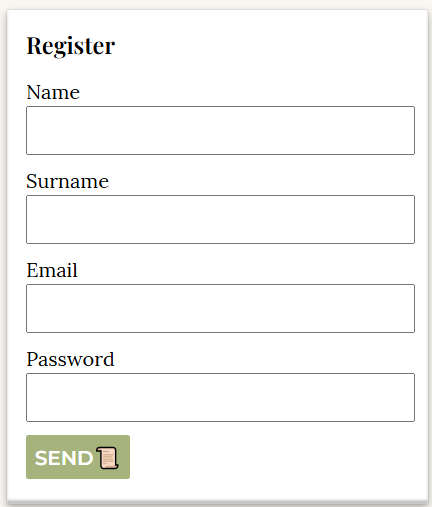

# ☕ BookMood — PHP & MySQL Blog Platform
BookMood is a web platform built with PHP, MySQL, HTML, and CSS, allowing users to create, manage, and explore book-related entries.
It includes a full authentication system, roles, categories management, image uploads, and an admin dashboard.

## 🚀 Features
### 👤 User System
- Secure login & registration.
- Password hashing using password_hash() & password_verify().
- User roles:
  - 🧍 User → create/manage their own entries.
  - 🛡️ Admin → manage categories & users.
- Session-based authentication.

### 📕 Entries Management
🧍 Users can:
- Create new entries with:
  - Title
  - Cover image upload
  - Description
  - Category
  - Content 
- View, edit and delete their own posts.
- View entries sorted by date.
- Automatic deletion of image files when removing an entry.

### 📚 Category Management (🛡️ Admin)
- Add new categories.
- Delete categories.
- When deleting a category, all related entries AND their images are removed.
- Categories displayed and sorted alphabetically.

### 🖼️ Image Handling
- File upload with:
  ```html
  <input type="file" name="cover" accept="image/png, image/jpg, image/jpeg">
  ```
- Physical storage in `/assets/img/`
- Path stored in the database.
- Physical deletion via unlink() when:
  - Removing an entry
  - Removing a category (deletes all associated entry covers)

### 🔍 Search Engine
- Search entries by title or description.
- Form-based filtering (POST).

### 🎨 Color Palette
| Color Name           | Hex       | Preview                                                                               |
| -------------------- | --------- | ------------------------------------------------------------------------------------- |
| **Primary Green**    | `#A6B37D` | <span style="display:inline-block;width:40px;height:20px;background:#A6B37D;"></span> |
| **Primary Brown**    | `#8B5E3C` | <span style="display:inline-block;width:40px;height:20px;background:#8B5E3C;"></span> |
| **Dark Gray**        | `#2E2E2E` | <span style="display:inline-block;width:40px;height:20px;background:#2E2E2E;"></span> |
| **Soft Gray**        | `#F4F6EF` | <span style="display:inline-block;width:40px;height:20px;background:#F4F6EF;"></span> |
| **Light Background** | `#FAF7F2` | <span style="display:inline-block;width:40px;height:20px;background:#FAF7F2;"></span> |
| **Link Gray**        | `#6E7C7C` | <span style="display:inline-block;width:40px;height:20px;background:#6E7C7C;"></span> |
| **Sidebar Text**     | `#4E4E4E` | <span style="display:inline-block;width:40px;height:20px;background:#4E4E4E;"></span> |

### ✍️ Typography Guide
#### Imported Fonts:
| Font Family                   | Usage                             | Weight | Style  |
| ----------------------------- | --------------------------------- | ------ | ------ |
| **Playfair Display Bold**     | Main titles (H1)                  | 700    | Normal |
| **Playfair Display SemiBold** | H2, H3                            | 600    | Normal |
| **Montserrat SemiBold**       | Buttons, nav, links, input submit | 600    | Normal |
| **Montserrat Medium**         | Optional UI elements              | 500    | Normal |
| **Lora**                      | Paragraphs, labels, form inputs   | 400    | Normal |
| **Lora Italic**               | Helper text / spans               | 400    | Italic |

#### By elements:
| Element                            | Font                      | Weight | Notes                      |
| ---------------------------------- | ------------------------- | ------ | -------------------------- |
| **H1**                             | Playfair Display Bold     | 700    | Uppercase, dark gray color |
| **H2**                             | Playfair Display SemiBold | 600    | Dark gray                  |
| **H3**                             | Playfair Display SemiBold | 600    | Used in sidebar blocks     |
| **Paragraphs (`p`)**               | Lora                      | 400    | Soft gray text (#555)      |
| **Labels**                         | Lora                      | 400    | Used in forms              |
| **Inputs (text, email, password)** | Lora                      | 400    | 16px size                  |
| **Buttons (primary & secondary)**  | Montserrat SemiBold       | 600    | Uppercase, animated hover  |
| **Links (`a`)**                    | Montserrat SemiBold       | 600    | Gray with hover effect     |
| **Span**                           | Lora Italic               | 400    | Small helper text          |

### 🧱 UI Component Overview
#### Buttons
- Primary Button
  - Background: #A6B37D <span style="display:inline-block;width:40px;height:20px;background:#A6B37D;"></span> → hover: #8B5E3C <span style="display:inline-block;width:40px;height:20px;background:#8B5E3C;"></span>
  - White text
  - Slight scale animation
- Secondary Button
  - Transparent
  - Border: #A6B37D <span style="display:inline-block;width:40px;height:20px;background:#A6B37D;"></span>
  - Hover: turns primary green

### 🖼 General Style
- Global font: Lora
- Smooth hover animations on articles, buttons, and menu links
- Elegant classic typography inspired by books and editorial design
- Warm color palette with green + brown literary tones
- Shadows and subtle gradients for a soft, 3D feel


### 🔐 Security
- SQL injection protection on sensitive queries (prepared statements).
- Input sanitization with mysqli_real_escape_string.
- Server-side validation for all forms.

| Area     | Technology                          |
| -------- | ----------------------------------- |
| Backend  | PHP 8+                              |
| Database | MySQL / MariaDB                     |
| Frontend | HTML5, CSS3                         |
| Sessions | Native PHP Sessions                 |
| Images   | `move_uploaded_file()` + `unlink()` |


### 📁 Project Structure
```pgsql
bookmood/
│
├── actions/
│   ├── login.php
│   ├── logout.php
│   ├── register.php
│   ├── save-entry.php
│   ├── remove-entry.php
│   ├── save-category.php
│   ├── remove-category.php
│
├── assets/
│   └── img/
│       └── (uploaded covers)
│
├── includes/
│   ├── connection.php
│   ├── header.php
│   ├── sidebar.php
│   ├── footer.php
│   ├── helpers.php
│
├── create_entry.php
├── edit_categories.php
├── remove_users.php
├── modify_mydata.php
├── index.php
├── entry.php
└── search.php
```

## ⚙️ Installation
### 1️⃣ Clone the repository
```bash
git clone https://github.com/yourrepo/bookmood.git
cd bookmood
```
### 2️⃣ Create the database
Inside `bookman/assets/sql` directory, there's two sql file's:
1. `database.sql` which contains the sql queries to create the whole database with it's tables
2. `admin.sql` a query to create an admin user role on the first registry of an user.
Use the queries inside `database.sql` first, and leave the second one for later.

### 3️⃣ Configure database connection
Edit server, name, password and database in `includes/connection.php`, otherwise leave it by default: 
```php
$server = "localhost"; #server path
$username = "root"; #username
$password = "1234"; #password
$database = "bookmood"; #database name

$db = mysqli_connect($server, $username, $password, $database);
mysqli_query($db, "set names 'utf8'");
session_start();
```
### 4️⃣ Set `assets/img/` folder permissions:
```bash
chmod -R 755 assets/img
```

### 5️⃣ Create 🛡️Admin User:
1. Register on the website by fullfilling the form down-rigth on the sidebar
<br/>
2. Copy query inside `bookman/assets/sql/admin.sql`
3. Execute query on your prefered IDE


### ✨ Author
Marc Lopez
Creator of BookMood
📧 marclopez.mahon@gmail.com